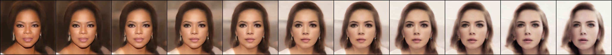

## Image2Style GAN in PyTorch

Implementation of "Image2StyleGAN: How to Embed Images Into the StyleGAN Latent Space?" (https://arxiv.org/pdf/1904.03189.pdf) in PyTorch 
StyleGAN2 base code borrowed from (https://github.com/rosinality/stylegan2-pytorch)

## Environment Setup
 - Download the pretrained StyleGAN2 weights from here:
  [Link](https://drive.google.com/open?id=1PQutd-JboOCOZqmd95XWxWrO8gGEvRcO)

## Projecting an Image to extended W+
 - `python image2styleGAN.py --ckpt=<pretrained_stargan2_model>  --task="projection" --image_path=<path_to_image>`
 - Other Relevant Options: 
   - "--w_init" : "mean_face" or "random_uniform"
   - "--viz_frequency" : frequency for saving intermediate images (default=100)
 - Saves the optimal projected W+ tensor at "projected_wplus/{image_name}.pt"
  

## Image Morphing
 - Project image A, B separately using the above method
 - `python image2styleGAN.py --ckpt=<pretrained_stargan2_model>  --task="image_morphing" --path_w_a=<path_to_a> --path_w_b=<path_to_b>`
 <!-- - `CUDA_VISIBLE_DEVICES=7 python im2stGAN.py --task="image_morphing" --path_w_a="projected_wplus/morphing_test_A.pt" --path_w_b="projected_wplus/morphing_test_B.pt"` -->
 - Other relevant options:
   - "--output_file" : path to save the output morphing image to 
   - "--blend_step" : the step size for linear interpolation of w+

## Style Transfer
 - Project image A, B separately using the above projection method
 - `python image2styleGAN.py --ckpt=<pretrained_stargan2_model>  --task="style_transfer" --path_w_a=<path_to_a> --path_w_b=<path_to_b>`
 - Other relevant options:
   - "--output_file" : path to save the output morphing image to 
 <!-- - `CUDA_VISIBLE_DEVICES=7 python im2stGAN.py --task="style_transfer" --path_w_a="projected_wplus/style_test_A.pt" --path_w_b="projected_wplus/style_test_B.pt" --output_file="viz/image_style_transfer.png"` -->
 -  
 -  
 -  

## Credits
 - https://github.com/rosinality/stylegan2-pytorch
 - 